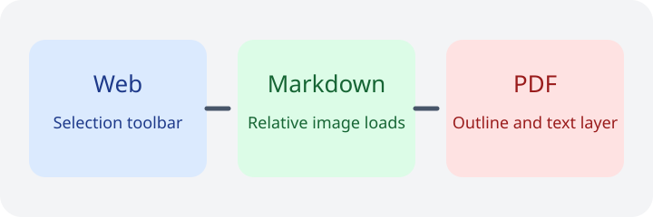

# Translater Markdown Smoke Test

Use this file to validate the custom Markdown viewer.

## Vocabulary

Double-click **metamorphosis** and confirm the dictionary popup appears.

Double-click `1234` or `...` and confirm no dictionary popup appears.

## Sentence Translation

Select **The quick brown fox jumps over the lazy dog.** and confirm the floating toolbar appears.

Select **Selection translation should stay consistent across every reading surface.** and compare the popup behavior with the web page and PDF viewer.

## Sidebar And Relative Paths

- [Open the sibling Markdown note](./reference-note.markdown)
- [Open the PDF smoke file](./viewer-smoke.pdf)
- [Jump to the navigation section](#sidebar-and-relative-paths)

## Sanitization Checks

The button below should render, but its inline event handler must not survive sanitization.

<button onclick="window.translaterMdButtonClicked = true">Unsafe inline button</button>

The link below should stay visible, but its `javascript:` URL must be removed.

<a href="javascript:alert('unsafe-link')">Unsafe link that should be sanitized</a>

The script block below must not execute.

